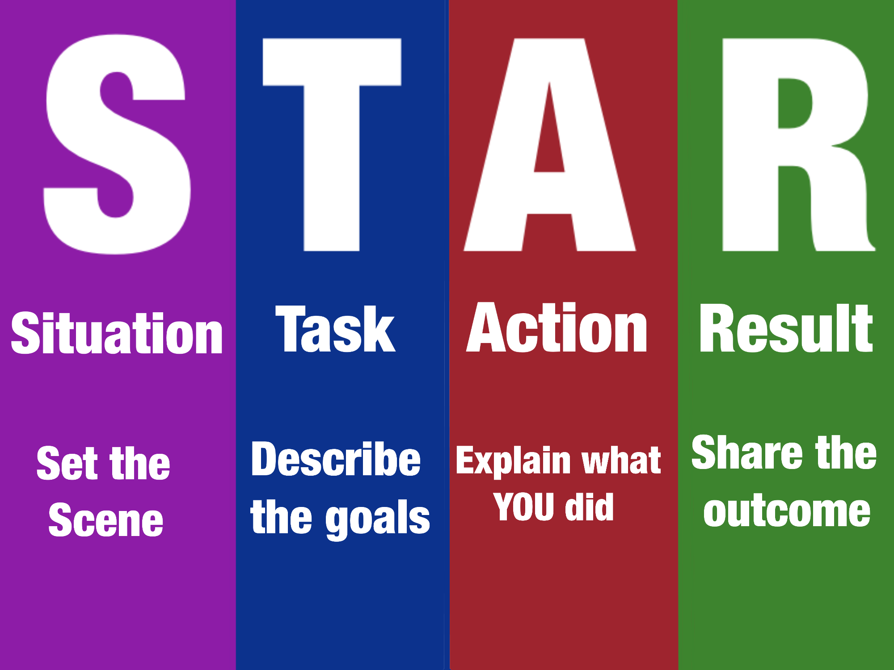

# Interview style questions
This page covers questions that can be used in all types of interviews. For questions and example answers for more specific subject areas, they are found in the folders.

## Tell me about yourself.
Hello, my name is Luke, I am from Brighton, and I am starting my career in the tech industry. In my spare time, I enjoy programming classic games from scratch in Python. With my master's degree in physics from the University of Surrey, I have gained experience in coding, presentation, writing, and group work. I also gained experience during my research placement at the University of Brighton, where I conducted phosphor thermometry research. This experience taught me persistence and independence. My passion is to find opportunities to apply my skills in real-world situations and through complex problem-solving. My skill set includes 4 years of Python experience gained through university projects, as well as teaching myself LaTeX and MATLAB while on placement. I was able to write a PHD-style dissertation and a literature review while also presenting these projects to a diverse range of audiences.

Hello, my name is Luke, I am from Brighton, and I have just recently graduated from the University of Surrey with a master’s degree in physics. From my degree I have developed a wide range of skills which I look forward to developing and optimizing in my career. My strongest skill is my coding abilities, with 4 years experience of python as well as knowledge into other languages as MATLAB, LaXeT, and mathematica, I enjoy coding alot and is the reason it leads me to tech. In my free time I enjoy practicing my coding skills through creating classic games such as Pokémon and battleships. As for experience, I have worked both as a cleaner and as a student researcher, as for cleaner I had the opportunity to work for an agency leading me to gain experience with working for a client. For my research, I have gained vast skills in both hard and soft skills, the main takeaway from my research experience was the ever-changing environment and work I had to endure, with this I gained confidence in working in new places and environments, making me a very adaptable and fast learner, this is why I went for DevOps, it's for me the best role to match the skills I have. I am excited to start my career as a DevOps engineer and to see where it takes me.

### Key feedback:
- Flowed well with no stuttering or pausing.
- Embedded the background and was well-rounded.
- Skills are formatted in a list style and would be better instead in a more free flowing and natural style like the rest of my TMAY
- When speaking, project myself better and raise my voice (~10%) higher.
- Listing skills need to be more conservational, a bit more fun
- Need a strong ending.
- Pratice more.

### Useful feedback from others to use:
- Integrate skills and experience into the philosophy of DevOps
- Possible write it more like a story format
- Good posture and eye contact
- Involve more about passion for DevOps
- Mention hobbies
- Include a positive reason why I want to join DevOps

### Other notes:
"During my placement I worked on communication through communicating with supervisors, peers and other academic staff to ensure the best results out of my research"
Lot of technical, need to mention soft skills 

"This netted me positive communication skills" (can use different skills)
which meant I have

What was a time you had to change your working style due to different working enviroment or different 

## STAR method style questions!
The STAR method is a structured approach used to answer interview questions effectively. It stands for Situation, Task, Action, and Result, helping candidates provide comprehensive responses.
### Star Format:

 - **Situation:** Describe the context or scenario where you faced a challenge or opportunity.
 - **Task:** Specify your role and what needed to be accomplished.
 - **Action:** Explain the steps you took to address the situation, focusing on your skills and decisions.
 - **Result:** Highlight the outcomes and impact of your actions, quantifying achievements when possible.
    

### Examples:

#### Explain a time when you worked well as part of a team

#### Describe a situation where you had to meet a tight deadline.

#### Can you share an example of a challenging project you worked on?

#### Tell me about a time when you had to resolve a conflict with a coworker or team member. 

#### Share an experience where you had to adapt to a significant change in your work environment or responsibilities.

#### Describe a situation in which you identified a problem or inefficiency in a process or system. 

#### Can you provide an example of a project where you had to work with a cross-functional team?

#### Tell me about a time when you had to handle a dissatisfied customer or client.

#### Share an experience in which you had to take the lead on a project or initiative.

#### Describe a situation where you had to prioritize multiple tasks or projects with competing deadlines.

#### Can you provide an example of a time when you successfully implemented a new idea or process that improved efficiency or productivity in your department or organization?
