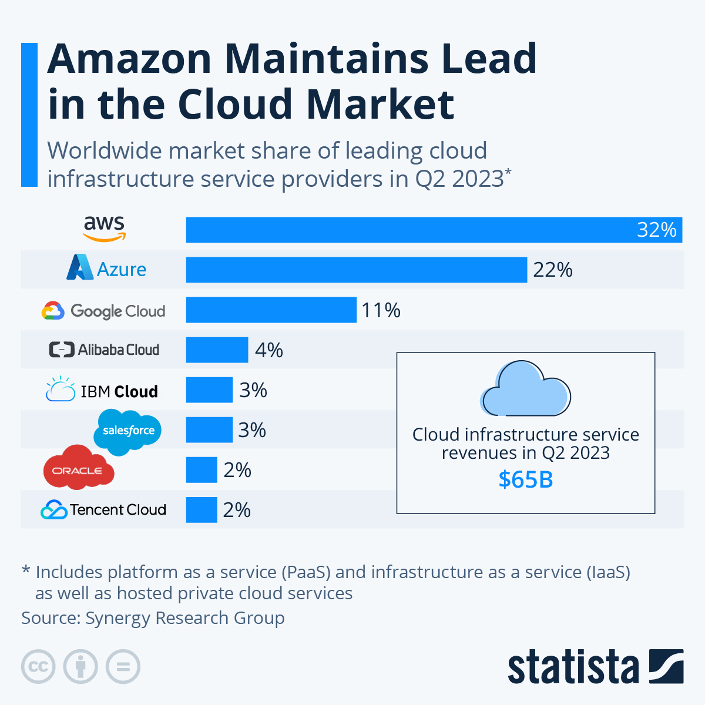

### What is cloud computing?

- 
Cloud computing is like renting computer resources over the internet. Instead of owning and managing your own servers, you can tap into powerful data centers to run your apps and store data. It's convenient, cost-effective, and scalable – perfect for businesses and individuals alike!

### Explain to me the history of cloud computing.

- It all started with timesharing in the 1960s when multiple users shared a mainframe. Fast forward to the 2000s, Amazon Web Services (AWS) revolutionized things by offering on-demand computing resources. This paved the way for today's cloud-based world, powering our digital lives!

### What can you do with Cloud Computing?

- Cloud computing is a game-changer! It lets you store, access, and process data and applications over the internet instead of on your local device or server. You can scale resources up or down as needed, collaborate globally, and enjoy cost-efficiency. It powers everything from web hosting to AI and much more.

### What is “On-Prem”?

- "On-prem," short for "on-premises," refers to the practice of hosting and managing software or hardware within an organization's physical location, rather than in the cloud or at a remote data center. This approach gives businesses more control over their IT infrastructure but also requires significant maintenance and resources.

### What are the 4 TYPES of Cloud?
The four main types of cloud computing are:

- **Public Cloud:** Services are provided by third-party vendors and shared among multiple users over the internet.

- **Private Cloud:** Infrastructure and services are exclusively dedicated to a single organization, offering greater control and security.

- **Hybrid Cloud:** Combines both public and private clouds, allowing data and applications to move seamlessly between them.

- **Multi-Cloud:** Involves using multiple public or private clouds simultaneously to meet various business needs, enhancing flexibility and redundancy.

Each type has its own advantages, and businesses often choose a combination that suits their needs best.

### What are the different types of cloud SERVICE?
Cloud services come in various flavors to cater to different business needs:

- **Infrastructure as a Service** (IaaS) provides virtualized computing resources like servers and storage.

- **Platform as a Service** (PaaS) offers a development platform with tools and services for app creation.

- **Software as a Service** (SaaS) delivers fully-fledged software applications over the internet.

These options allow businesses to choose the right cloud service model that suits their requirements and budget.

### What are the advantages to cloud computing for businesses?

- It slashes IT costs by eliminating the need for hefty infrastructure investments. Plus, it provides scalability, enabling easy resource adjustments as your company grows. Collaboration gets a boost with remote access to data, enhancing productivity and agility. In essence, it's a cost-effective, flexible, and efficient solution.

### What are the disadvantages to cloud computing for businesses?

- Firstly, there's the concern of data security, as entrusting sensitive information to a third-party provider can be risky. Secondly, there may be potential downtime or service interruptions, which can disrupt operations. Lastly, costs can spiral if not managed effectively, as subscription fees and data transfer expenses can add up quickly. So, it's crucial for businesses to carefully weigh these factors when considering cloud solutions.

### What is the difference between OpEx and CapEx?

- **Operating Expenses** - Operating expenses are a company's day-to-day expenses. More impactful purchases that are less impactful on the business.

- **Capital Expenditures** - Capital expenditures are a company's major, long-term expenses. Bigger upfront purchases that are less impactful on the business. 

### What is market-share?

- Market share is calculated by taking the company's sales over the period and dividing it by the total sales of the industry over the same period.

### What are the 3 largest Cloud providers?

- Amazon Web Services (AWS) - 32% MarketShare
- Microsoft Azure - 22% MarketShare
- Google Cloud Platform (GCP) - 11% MarketShare

#### What makes them popular? 
- Amazon Web Services (AWS) is popular due to its extensive service offerings and global infrastructure, providing scalability and reliability for businesses of all sizes.

- Microsoft Azure gains popularity with its seamless integration of cloud services and enterprise software, making it a top choice for businesses utilizing Microsoft products.

- Google Cloud Platform (GCP) stands out for its cutting-edge technology, particularly in machine learning and data analytics, attracting businesses seeking advanced solutions.

#### Which one has the largest market-share?

### How does DevOps relate to cloud computing?

- **Easy to Use:** Cloud platforms offer user-friendly interfaces and automation tools, simplifying deployment and management in DevOps workflows.

- **Flexibility:** Cloud enables scalable resources on-demand, adapting to workload changes, a key DevOps requirement for agility.

- **Robustness:** Cloud providers offer redundant infrastructure, enhancing system reliability and uptime, aligning with DevOps' focus on stability.

- **Cost:** DevOps leverages cloud's pay-as-you-go model, optimizing resource allocation, reducing costs, and maximizing ROI.
